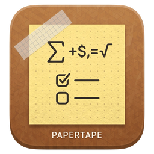

# PaperTape

> **The minimalist scratchpad for macOS & Windows with reactive Soulver math, live conversions, and instant screenshot streams. Built with Tauri 2.0 & Rust.**

<p align="center">
  
</p>

<p align="center">
  <a href="https://github.com/AtomAyman/PaperTape/releases"></a>
  <a href="https://tauri.app"></a>
  <a href="https://www.rust-lang.org"></a>
  <a href="https://react.dev"></a>
  <a href="LICENSE"></a>
</p>

---

## ✨ Features

* **🧮 Reactive Soulver-Style Math**: Live percentage math (`150 + 20% = 180`, `25% off $80`), currency calculations, line totals (`sum()`, `avg()`, `count()`), and persistent variable definitions (`rate = $45/hr`).
* **⏱️ Natural Date & Time Arithmetic**: Natural language date offsets (`today + 30 days`, `Oct 1 + 90 days`), durations (`9:30 am to 5:45 pm`), and live global time zone conversions (`5pm EST to PST`).
* **📸 ⌘⇧5 Interactive Screenshot Framing**: Pixel-perfect draggable selection overlay with live dimension badge (`850 × 480`), instant preview, and automatic archiving into a dedicated Screenshot Stream.
* **📋 Clipboard Stream**: Optionally auto-capture copied snippets into a designated live feed without leaving your workflow.
* **📑 9 Color-Coded Slots & Permanent Vault**: Organize multiple concurrent tasks or thoughts across 9 fast-switching slots, plus permanent Markdown document sync to `~/Documents/PaperTape/`.
* **🎨 5 Thoughtful Themes**: Switch between *A24 Film Slate*, *Muad'Dib Desert*, *Tokyo Cyberpunk*, *Vintage Paper (Field Notes)*, and *Obsidian Noir*.
* **🔒 100% Offline & Private**: Zero telemetry, zero cloud tracking, zero account sign-ins. Your notes stay entirely on your machine.

---

## ⌨️ Default Keyboard Shortcuts

| Action | macOS Shortcut | Windows Shortcut | Customizable |
| :--- | :--- | :--- | :---: |
| **Toggle HUD Window** | <kbd>⌥ Option</kbd> + <kbd>A</kbd> | <kbd>Alt</kbd> + <kbd>A</kbd> | ✅ |
| **Interactive Screen Crop** | <kbd>⌥ Option</kbd> + <kbd>⇧ Shift</kbd> + <kbd>S</kbd> | <kbd>Alt</kbd> + <kbd>Shift</kbd> + <kbd>S</kbd> | ✅ |
| **Screenshot Stream** | <kbd>⌘ Cmd</kbd> + <kbd>⇧ Shift</kbd> + <kbd>X</kbd> | <kbd>Ctrl</kbd> + <kbd>Shift</kbd> + <kbd>X</kbd> | ✅ |
| **Clipboard Stream** | <kbd>⌘ Cmd</kbd> + <kbd>⇧ Shift</kbd> + <kbd>V</kbd> | <kbd>Ctrl</kbd> + <kbd>Shift</kbd> + <kbd>V</kbd> | ✅ |

*All shortcuts can be remapped anytime under **Settings (⚙️) ➔ Keyboard Shortcuts**.*

---

## 🚀 Installation & Releases

### macOS
1. Download **`PaperTape-1.0.0-Universal.dmg`** from the [Releases](https://github.com/AtomAyman/PaperTape/releases) page.
2. Drag `PaperTape.app` into your `Applications` folder.
3. *Universal 2 Binary*: Natively supports both **Apple Silicon (M1–M4)** and **Intel** Macs.
4. *Zero Gatekeeper Warnings*: Authentically signed with Apple Developer ID and fully notarized by Apple.

### Windows
1. Download the latest **`PaperTape-Setup.exe`** (NSIS installer) or **`.msi`** from the [Releases](https://github.com/AtomAyman/PaperTape/releases) page.
2. Run the installer.
3. *Note*: On first launch, Windows SmartScreen may show an unrecognized publisher prompt. Click **More info ➔ Run anyway**.

---

## 🛠️ Development & Building

### Prerequisites
* [Node.js](https://nodejs.org) (v18+)
* [Rust](https://www.rust-lang.org) (stable toolchain)
* [Tauri CLI](https://tauri.app/start/)

### Setup
```bash
# Clone the repository
git clone https://github.com/AtomAyman/PaperTape.git
cd PaperTape

# Install dependencies
npm install
```

### Run in Development
```bash
npm run tauri dev
```

### Build Production Releases
```bash
# Build frontend and compile native bundle
npm run build
npm run tauri build
```

---

## 📄 License

Distributed under the **MIT License**. See [`LICENSE`](LICENSE) for details.
